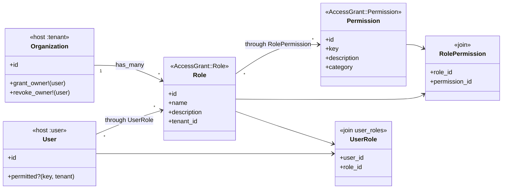
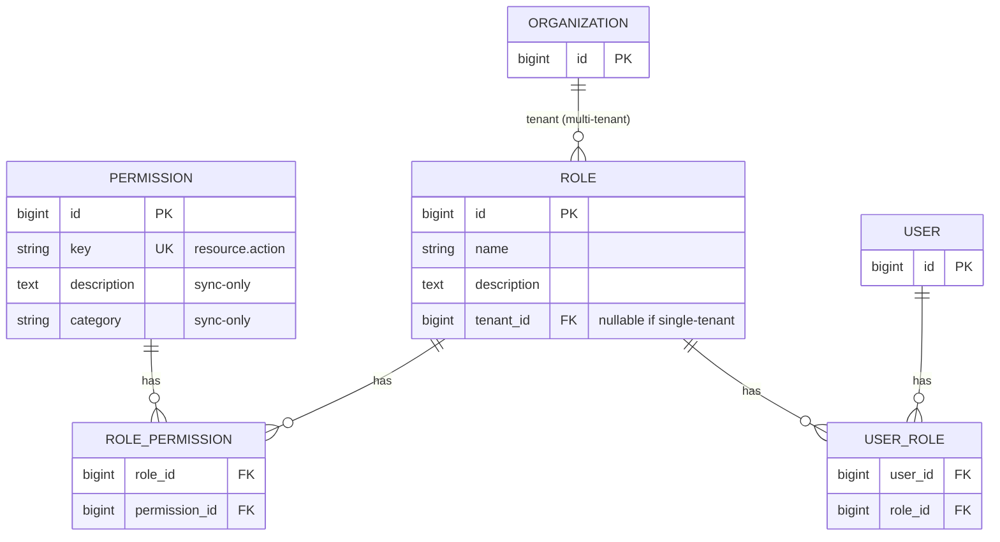

# AccessGrant: Architecture & Design

> Status: **design finalized** (docs only — not yet implemented). Ready for
> an implementation plan. See [proposal.md](proposal.md) for the problem this
> solves. Owner:
> [superpowers/specs/2026-09-05-owner-role-design.md](superpowers/specs/2026-09-05-owner-role-design.md).
> Acceptance inventory:
> [superpowers/specs/2026-09-07-usage-scenarios.md](superpowers/specs/2026-09-07-usage-scenarios.md).

## Data model

All tables are ActiveRecord/SQL, owned by the host app's database (this gem
ships migrations via a generator; it does not run its own separate
database).

```
tenant (host app model, e.g. Organization) — multi-tenant only
  └─┬─ roles (or access_grant_roles)     (belongs_to tenant when multi-tenant;
    │                                    global when single-tenant)
    └─┬─ role_permissions (or prefixed)
      └── permissions (or prefixed)      (catalog: key, description, category)

user (host app model, e.g. User)
  └── user_roles (or access_grant_user_roles / configured name)
```

### Class diagram

Host models are outside the gem (`Organization`, `User`). Gem models use
configurable table names; associations stay `roles` / `permissions`.





**Table names are chosen at setup** (see [Configuration layout](#configuration-layout--initializers)):
use short names (`roles`, `permissions`, …) when free; if those tables (or
models) already exist, fall back to `access_grant_*` (or a custom name the
host supplies). Association names on models stay short (`has_many :roles`
via the DSL); `config.tables` holds the physical names.

### Indexes (hot paths)

| Table | Index | Why |
|---|---|---|
| `permissions` | unique `key` | `permitted?` / sync upsert |
| `permissions` | `(category, key)` | Search/group by model/controller (`Permission.by_category("invoices")`, `ordered_for_ui`) |
| `roles` | unique `(tenant_id, name)` | Per-tenant role list + uniqueness |
| `roles` | `name` | Owner/Recovery `LOWER(name)` lookups |
| `role_permissions` | unique `(role_id, permission_id)` + FK indexes | Join integrity; `permitted?` exists |
| `user_roles` | unique `(user_id, role_id)` | Assignments from user; idempotent assign |
| `user_roles` | `role_id` | Last-Owner assignment count / reverse lookup |

Case-insensitive role uniqueness is enforced in AR validations; a DB expression unique index (`LOWER(name)`) is adapter-specific and left for hosts that need concurrent-create protection beyond validation.

### Models (shape and who may edit)

**`AccessGrant::Permission`** (table: configured `permissions` name)

| Column | Type | Editable by |
|---|---|---|
| `key` | string, unique, format `resource.action` | **Dev only** (catalog DSL + sync). Immutable after insert except via deliberate retirement tooling. |
| `description` | text/string | **Dev only** — set/updated by `access_grant:sync_permissions` from `permissions.rb`. |
| `category` | string, optional | **Dev only** — same (sync from catalog). UI grouping label, not an auth factor. |
| timestamps | | |

**What `category` stores:** a short **grouping label for admin UIs** (and
docs), synced from the catalog. It does **not** affect `permitted?`.

| Source in `permissions.rb` | Stored `category` | Example keys |
|---|---|---|
| `resource :invoices` | `"invoices"` (default = resource name) | `invoices.index`, `invoices.couple` |
| `category "billing" do … end` | `"billing"` | `billing.export` |
| optional override on an action | whatever string you set | rare |

```ruby
AccessGrant.permissions do
  resource :invoices   # category => "invoices"

  category "billing" do
    permission "billing.export", "Export billing CSV"
  end
end
```

Admin “edit role” screens typically group checkboxes by `category`. Values
are free-form strings from the host catalog (keep them stable;
renaming a category is a code + sync change, same as description).

**Keep it simple — no `Category` model.** A string column on `permissions`
is enough (same pattern many apps use: group by resource/model name).
Defaulting `category` to the resource name (`invoices`) matches “category
as model/resource name.” Use an explicit `category "billing"` block only
when you want a custom grouping. Do not introduce a categories table or
AR association for v1.

- Never created or updated through an admin UI. Sync is the writer for
  metadata (`description`, `category`).
- If a host admin form somehow PATCHes `description`, that is a **host
  mistake**: next deploy sync will overwrite it from code. The gem does
  not need a hard DB lock for v1; document “do not expose permission
  CRUD in admin.” Optional later: `readonly` attributes outside sync.
- Admins **select** existing permission rows when editing a role’s grants
  (checkbox list). They do not invent keys or edit permission copy.

```ruby
# config/access_grant/permissions.rb — only place for permission description
resource :invoices do
  action :index, description: "List invoices"
  action :couple, description: "Couple invoices together"
end
```

**`AccessGrant::Role`** (table: configured `roles` name)

| Column | Type | Editable by |
|---|---|---|
| `name` | string | Admin (ordinary roles). Case-insensitive unique per tenant/scope. Owner name reserved when Owner enabled. |
| `description` | text/string, optional | **Admin** — free to create/update anytime (e.g. “Can view invoices, not destroy”). |
| `tenant_id` / FK | when multi-tenant | Set at create; immutable (do not move roles across tenants). |
| timestamps | | |

- Ordinary roles: full admin CRUD (name, description, permission set).
- Owner: subject to Owner protection rules (see Owner section).

**`AccessGrant::RolePermission`** — join `role_id` + `permission_id`,
unique pair. Admin edits the **set** of permissions on a role (attach /
detach catalog rows), not permission rows themselves.

**User↔role join** — e.g. `user_roles`. Assign/remove roles for a user
within a tenant. Many-to-many. No Membership model in the gem.

### Shared user vs one user per tenant

The gem always treats **user** as whatever `user_class` is (usually
`User`) and **roles as scoped to a tenant** (or global in single-tenant
mode). It does not care whether that User row is “only in one org” or
shared across orgs — that is a **host** modeling choice.

| Host pattern | How it works with AccessGrant |
|---|---|
| **Shared user across tenants** (one `User`, many orgs) | Same Maya has Acme roles and Beta roles via `user_roles`. Checks use `permitted?("invoices.index", tenant: acme)` vs `tenant: beta`. Cross-tenant roles on one user are **valid and expected**. |
| **Unique user per tenant** (separate `User` rows, or login only inside one org) | Still the same APIs. Each user row only gets roles for the tenants they belong to. Host enforces “user belongs to one org” (validations, invitations). Gem does not enforce uniqueness of user↔tenant. |
| **Membership as join (host-only)** | Host may have `memberships` for “user in org.” AccessGrant still attaches roles to **User** (or whatever user class is). Host should revoke/cleanup `user_roles` when membership ends — that gate is host-owned (see usage scenarios S065). |

```ruby
# Shared user — fine
acme_viewer = acme.roles.find_by!(name: "Viewer")
beta_viewer = beta.roles.find_by!(name: "Viewer")
maya.roles << acme_viewer
maya.roles << beta_viewer
maya.permitted?("invoices.index", tenant: acme)  # uses Acme roles only
maya.permitted?("invoices.index", tenant: beta)  # uses Beta roles only
```

Do **not** put `tenant_id` on the user↔role join for “which org is this
assignment for?” — the **role** already belongs to the tenant. That keeps
one join table and avoids duplicating scope.

**`permitted?(key, tenant:)`** — mixed into the user model. Union of
permission keys across the user's roles (SQL join). **No gem-level
memoization in v1**. Multi-tenant: `tenant:` required. Single-tenant: omit
`tenant:`. Keys must match `resource.action`.

### Edit boundary (summary)

| | Permission key / description / category | Role name / description | Role’s permission set |
|---|---|---|---|
| Developer (code + sync) | Yes | Seed defaults only | Seed defaults only |
| Tenant admin (runtime UI) | **No** | Yes (ordinary roles) | Yes (pick from catalog) |
| Host responsibility | Do not build admin screens that edit `Permission` | Role forms | Role forms |

Enforcing “admins can’t edit permission description” in the product UI is
primarily a **host** concern. The gem’s contract is: sync owns permission
metadata; role description is a normal attribute for admins.


## Extension points (DSL)

"Tenant" and "user" are host app concepts. The gem needs a declaration
mechanism rather than hardcoding class names.

```ruby
class Organization < ApplicationRecord
  access_grant :tenant
end

class User < ApplicationRecord
  access_grant :user
end
```

- `access_grant :tenant` — declared on the host app's tenant model
(multi-tenant). Sets up `has_many :roles`, inverse wiring, and
`grant_owner!` / `revoke_owner!`.
- `access_grant :user` — declared on the host app's user model.
Sets up the roles association (through the host-named join table) and
mixes in `permitted?`.

Naming rationale: one method, two hats — simpler than
`acts_as_permission_tenant` / `acts_as_permissible`, and still obvious from
reading the model which classes participate.

### Generators (two-phase)

```
rails g access_grant:install
rails g access_grant:setup
```

`install` writes core migrations using **placeholder table names**
resolved later by setup (or regenerates migrations once names are known —
implementation detail: prefer setup emitting the final migrations so names
are correct before `db:migrate`).

`setup` accepts flags or asks interactively when omitted:

```
rails g access_grant:setup \
  --multi-tenant \
  --tenant=Organization \
  --user=User \
  --owner-role=protected \
  --tables=auto
```


| Flag                                 | Meaning                                           | Default          |
| ------------------------------------ | ------------------------------------------------- | ---------------- |
| `--multi-tenant` / `--single-tenant` | Scope mode                                        | asked if omitted |
| `--tenant=Organization`              | Tenant class (multi-tenant only)                  | `Organization`   |
| `--user=User`                      | User class                                      | `User`           |
| `--owner-role=protected`             | Owner mechanism                                   | `protected`      |
| `--tables=auto`                      | Collision-aware names (see below)                 | `auto`           |
| `--tables=simple`                    | Force `roles` / `permissions` / … (fail if taken) |                  |
| `--tables=prefixed`                  | Always `access_grant_*`                           |                  |


**Table naming (**`--tables=auto`**, recommended):**

1. Check whether `roles`, `permissions`, `role_permissions`, and
  `{user}_roles` / `user_roles` already exist (schema and/or models).
2. If **free** → use those short names.
3. If **taken** → use `access_grant_`* (or prompt for a custom name when
  interactive).
4. Write the chosen map into `config.tables` in the boot initializer.

Then writes:

- Final migrations (tenant FK when multi-tenant; user↔role join).
- Config files — see [Configuration layout](#configuration-layout--initializers).
- Patches tenant/user models with `access_grant :tenant` /
`access_grant :user` (skips if already present; fails clearly if a
model file cannot be found).


### Installation checklist (including deploy sync)

Catalog sync is **not** a schema migration. After install, and on **every
deploy** that might change `config/access_grant/permissions.rb`, the host
must run:

```
bundle exec rake access_grant:sync_permissions
```

Document this in the host app’s release process. Examples:

```yaml
# Kamal — hook after migrate (illustrative)
# .kamal/hooks/post-deploy or release command:
#   bin/rails db:migrate && bin/rails access_grant:sync_permissions
```

```ruby
# Heroku release phase (Procfile)
# release: bundle exec rails db:migrate && bundle exec rake access_grant:sync_permissions
```

```ruby
# Capistrano (illustrative)
# after "deploy:migrate", "access_grant:sync_permissions"
```

The `setup` generator should print this reminder and can optionally append a
commented snippet to `lib/tasks/access_grant_deploy.rake` or the host’s
deploy docs — the important part is the **host wires sync into deploys**,
not that developers remember a manual rake after each push.

Skipping sync after adding keys means new permissions exist in code but not
in the DB (checks raise on unknown keys once validated against the catalog /
DB — see resolved decisions). Old keys left in the DB after removal from
code still work until deliberately retired.

## Configuration layout / initializers

One **boot** initializer plus dedicated AccessGrant config files (not three
competing Rails initializers):

```
config/
  initializers/
    access_grant.rb           # boot wiring + all config.* options
  access_grant/
    permissions.rb            # catalog DSL
    roles.rb                  # default roles / on_tenant_created
```

The `setup` generator writes a fully commented `access_grant.rb` so every
option is visible to the host developer. Below is the reference.

### Configuration reference

All options are set via:

```ruby
AccessGrant.configure do |config|
  # ...
end
```

#### `tenant_class`

- **Type:** `String` or `nil`
- **Default:** `nil` (single-tenant)
- **Meaning:** Host model that owns roles (e.g. `"Organization"`). When set,
  the install is multi-tenant: roles get a tenant FK, and `permitted?`
  requires `tenant:`.
- **Example:**

```ruby
config.tenant_class = "Organization"
# Single-tenant: omit or set nil
# config.tenant_class = nil
```

#### `user_class`

- **Type:** `String`
- **Default:** `"User"`
- **Meaning:** Host model that receives roles and `permitted?` (Devise-style
  user). Rename if the host uses `Account`, etc.
- **Example:**

```ruby
config.user_class = "User"
# config.user_class = "Account"
```

#### `owner_role`

- **Type:** `Symbol` — `:protected` | `:bypass` | `:both` | `:none`
- **Default:** `:protected`
- **Meaning:** How privileged the Owner role is. See [Owner role](#owner-role).
- **Example:**

```ruby
config.owner_role = :protected
# config.owner_role = :none   # no special Owner; grant_owner! raises
```

#### `owner_role_name`

- **Type:** `String`
- **Default:** `"Owner"`
- **Meaning:** Reserved role name for the privileged floor (case-insensitive).
- **Example:**

```ruby
config.owner_role_name = "Owner"
# config.owner_role_name = "Super Admin"
```

#### `tables`

- **Type:** `Hash` with keys `:roles`, `:permissions`, `:role_permissions`,
  `:user_roles`
- **Default:** short names (`"roles"`, `"permissions"`, …)
- **Meaning:** Physical table names (chosen by setup `--tables=auto|simple|prefixed`).
- **Example:**

```ruby
config.tables = {
  roles: "roles",
  permissions: "permissions",
  role_permissions: "role_permissions",
  user_roles: "user_roles"
}
# After collision:
# config.tables = {
#   roles: "access_grant_roles",
#   permissions: "access_grant_permissions",
#   role_permissions: "access_grant_role_permissions",
#   user_roles: "access_grant_user_roles"
# }
```

#### `default_permission_actions`

- **Type:** `Array<String>`
- **Default:** `%w[index show create update destroy]`
- **Meaning:** Actions emitted for each `resource :name` in the catalog DSL
  (plus description templates). Add host-specific CRUD extras here.
- **Example:**

```ruby
config.default_permission_actions = %w[index show create update destroy]
# Include extras used by your app:
# config.default_permission_actions = %w[index show create update destroy search attach detach]
```

#### `current_user_method`

- **Type:** `Symbol`
- **Default:** `:current_user`
- **Meaning:** Controller method the authorize hook calls for the acting
  user. Only used by `access_grant_authorize!`.
- **Example:**

```ruby
config.current_user_method = :current_user
# config.current_user_method = :current_account
```

#### `current_tenant_method`

- **Type:** `Symbol`
- **Default:** `:current_tenant`
- **Meaning:** Controller method the authorize hook calls for the tenant
  (multi-tenant). Host must define that method. Unused when
  `tenant_class` is nil.
- **Example:**

```ruby
config.current_tenant_method = :current_tenant

# app/controllers/application_controller.rb
def current_tenant
  current_user&.organization
end

# Or if you already expose current_organization:
# config.current_tenant_method = :current_organization
```

#### `on_tenant_created`

- **Type:** `Proc` / callable `(tenant) -> void` or `nil`
- **Default:** `nil`
- **Meaning:** Invoked after a tenant record is created (`access_grant
  :tenant`). Seed default **role definitions** here — not Owner assignment
  (still `grant_owner!(user)`).
- **Example:**

```ruby
# Often in config/access_grant/roles.rb (generated by setup)
config.on_tenant_created = ->(tenant) do
  # Starter: Viewer + Manager per resource/category from synced permissions
  AccessGrant::Role.ensure_resource_defaults_for!(tenant)

  # Or explicit names:
  # AccessGrant::Role.ensure_defaults_for!(
  #   tenant,
  #   "Admin"  => %w[invoices.index invoices.update members.index],
  #   "Member" => %w[invoices.index]
  # )
end
```

#### `recover_access`

- **Type:** `Proc` / callable or `nil` (uses built-in default)
- **Default:** built-in `AccessGrant::Recovery.grant_role!`
- **Meaning:** Ops lockout recovery used by
  `rake access_grant:grant_role`. Override to integrate host tooling.
- **Example:**

```ruby
# Default behavior (no config needed):
# ROLE=Owner USER_ID=1 TENANT_ID=42 bundle exec rake access_grant:grant_role

config.recover_access = ->(role_name:, user_id:, tenant_id: nil) {
  AccessGrant::Recovery.grant_role!(role_name:, user_id:, tenant_id:)
}
```

### Full boot initializer example

```ruby
# config/initializers/access_grant.rb
AccessGrant.configure do |config|
  config.tenant_class = "Organization"
  config.user_class = "User"
  config.owner_role = :protected
  config.owner_role_name = "Owner"

  config.tables = {
    roles: "roles",
    permissions: "permissions",
    role_permissions: "role_permissions",
    user_roles: "user_roles"
  }

  config.default_permission_actions = %w[index show create update destroy]
  config.current_user_method = :current_user
  config.current_tenant_method = :current_tenant
end

Rails.root.glob("config/access_grant/**/*.rb").sort.each { |f| require f }
```

```ruby
# config/access_grant/permissions.rb
AccessGrant.permissions do
  resource :invoices do
    action :couple, description: "Can couple invoices together"
  end
end
```

```ruby
# config/access_grant/roles.rb
AccessGrant.configure do |config|
  config.on_tenant_created = ->(tenant) do
    AccessGrant::Role.ensure_defaults_for!(
      tenant,
      "Admin"  => %w[invoices.index invoices.update members.index],
      "Member" => %w[invoices.index]
    )
  end
end
```

**Controller-hook note:** `current_user` / `current_tenant` are **only** for
`access_grant_authorize!`. The `permitted?(key, tenant:)` API still takes an
**explicit** `tenant:` in multi-tenant mode (guardrail 2).

## Owner role

Owner is the configurable privileged floor. Full design:
[2026-09-05-owner-role-design.md](superpowers/specs/2026-09-05-owner-role-design.md).

**Gem vs host**

- Gem: Owner mechanisms, `grant_owner!` / `revoke_owner!`, at-least-one-Owner
on revoke, catalog re-attach for `:protected` / `:both`.
- Host: who is the creator and when to call `grant_owner!`. The gem does
not auto-detect creators (`Current.user`, creator columns, etc.).

```ruby
# Host responsibility after creating an org
org = Organization.create!(name: "Acme")
org.grant_owner!(current_user)

# Single-tenant (e.g. seeds)
AccessGrant.grant_owner!(maya)
```

Multiple Owners per scope are allowed. Revoking the last Owner fails when
Owner is enabled. Creating a tenant with zero Owners is allowed until the
host grants one.


| `owner_role`           | Meaning                                                                                                                 |
| ---------------------- | ----------------------------------------------------------------------------------------------------------------------- |
| `:protected` (default) | Owner row has every catalog key; sync keeps it complete; cannot strip/delete the role; `permitted?` stays a normal join |
| `:bypass`              | Having Owner short-circuits `permitted?` to true                                                                        |
| `:both`                | Protected rows plus short-circuit                                                                                       |
| `:none`                | No special Owner; `grant_owner!` raises                                                                                 |


## Catalog sync mechanism

New permission keys always require a code change (catalog DSL), but rolling
that out is a **data sync, not a schema migration**:

```
bundle exec rake access_grant:sync_permissions
```

Upserts into the configured permissions table (insert new keys, update
description/category, **never delete**). For `:protected` / `:both`, also
re-attaches every catalog permission to Owner roles. Removing a key from
code does not revoke grants — see resolved decisions on catalog retirement.

## Design principles / guardrails

These are commitments this gem's implementation must honor, not aspirational
guidance — they come directly from failure modes identified while auditing
the motivating host app's current ad hoc authorization code.

### 1. Self-service is not the complement of "lacks permission"

"Lacks permission X" and "is a restricted self-service identity" are
different facts and must be checked independently. A design where "no
`manage_x` permission" implicitly means "fall back to acting only on your own
record" breaks the moment roles are fully dynamic and deletable — there is no
guarantee a "no manage_x" identity is the self-service case at all. The
self-service/ownership check (e.g. "do you own this record?") must be its
own explicit, independent gate. Any broader permission is *additive* — it
grants more access — and must never be treated as the sole complement of "not
a manager."

**Example.** Maya is a worker with no `manage_timesheets` permission. The
app must not infer “so she may only edit her own timesheets.” That
self-service rule is a separate check (`timesheet.user_id == maya.id`).
Jordan has `manage_timesheets` — that *adds* the ability to edit anyone’s
sheet; it is not the sole definition of “not a worker.” If an admin deletes
every manage-role tomorrow, workers without an explicit ownership check
would otherwise fall into a broken “no permission ⇒ do nothing / do
everything” gap.

### 2. No permission check rides on ambient/global mutable state

A permission check must not silently depend on ambient/global state (e.g. a
`CurrentAttributes`-style singleton) that some other code path on the same
request can mutate. Anywhere a call site's context is something other than
"the current request's own user" (for example, a check performed on
behalf of a record fetched by ID rather than the requester themselves), the
the user must be passed explicitly as an argument rather than read off a
global. This closes a real hazard class: a controller that repoints a
`Current`-style singleton mid-request (e.g. based on a note's own
organization rather than the request's own header) can silently change what
a later ambient permission check evaluates against.

Creator detection for Owner assignment stays **out** of the gem — the host
passes the user into `grant_owner!` explicitly. Reading `current_user` /
`current_tenant` inside `access_grant_authorize!` is allowed at the
controller edge only; those values are passed into `permitted?` as
explicit arguments, not read again inside the check.

**Example.** A Notes controller loads a note, then does
`Current.organization = note.organization` so a partial can render the
note’s org name. Later in the same action,
`Current.user.permitted?(:delete_notes)` would silently evaluate against
the *note’s* org if `permitted?` read ambient Current — wrong if the
requester is acting as a member of a different org. Correct pattern:
`current_user.permitted?(:delete_notes, tenant: current_organization)`
with both values taken from the request’s own auth context, not from the
loaded record.

### 3. Migration sequencing for adopting the gem in an existing app

When a host app migrates from a legacy single-role column onto this gem's
tables, that migration path must be split into (at minimum) three separate
migrations, not one:

1. **Create** the new tables (`roles`, `role_permissions`, the
  user↔role join table).
2. **Backfill** data from the legacy column into the new tables.
3. **Drop** the legacy column.

Mixing "create tables" + "backfill via ActiveRecord models on those same
tables" + "drop a column" into a single migration risks schema-cache
staleness within that migration and complicates rollback. Steps 1 and 2 can
ship ahead of the code cutover safely (old code simply ignores the new,
unknown tables); step 3 must ship in the same deploy as the application code
that stops reading the dropped column. This applies both as guidance this
gem's docs give to host apps, and to how this gem's own future migrations
(e.g. adding a column to `roles`) should be structured.

**Example.** Host has `memberships.role` as a string. Ship migration A
(create AccessGrant tables) in deploy 1 with no app code change. Ship
migration B (backfill `roles` / joins from the string column) in deploy 2,
still reading the old column at runtime. Ship migration C (drop
`memberships.role`) in the same deploy that switches controllers to
`permitted?`. One big migration that creates, backfills via models, and
drops in a single transaction is harder to roll back and can see a stale
schema cache mid-run.

## Role name uniqueness

Within a scope (one tenant when multi-tenant; the whole app when
single-tenant), `roles.name` is **case-insensitive**. `"Owner"` and
`"owner"` collide. Store a canonical form (implementation detail: e.g.
preserve display casing the host passed on create, but uniqueness and
lookups use a case-insensitive comparison / unique index).

## Ordinary role walkthrough (public API)

Canonical everyday flow (ActiveRecord associations; no extra wrappers
required). Table/model names use the gem’s `AccessGrant::` models behind
`has_many :roles` / `has_many :permissions` as exposed by the DSL.

```ruby
# 1. Catalog already synced — e.g. "invoices.index", "invoices.update"
# 2. Create an ordinary role in Acme
viewer = acme.roles.create!(name: "Billing Viewer")
viewer.permissions = AccessGrant::Permission.where(key: %w[invoices.index])
# or: viewer.permission_keys = %w[invoices.index]  # if we expose that writer

# 3. Assign to Maya
maya.roles << viewer
# join uniqueness: repeating this is idempotent (no duplicate rows)

# 4. Checks
maya.permitted?("invoices.index", tenant: acme)   # => true
maya.permitted?("invoices.index", tenant: beta)   # => false

# 5. Edit grants atomically (replace whole set; failed validation → no partial apply)
viewer.permission_keys = %w[invoices.index invoices.update]

# 6. Admin form helpers (queries, not a separate admin gem)
AccessGrant::Permission.ordered_for_ui                   # catalog options (indexed)
AccessGrant::Permission.by_category("invoices")          # one model/controller group
viewer.permission_keys                                   # selected keys
maya.roles.merge(AccessGrant::Role.for_tenant(acme))     # roles in Acme only

# 7. Revoke assignment
maya.roles.destroy(viewer)  # or delete the join; missing assignment is a no-op
```

Public writer for a role’s grants is **`permission_keys=`** (array of
`resource.action` strings). It replaces the full set atomically. Assign /
remove user↔role is idempotent; scope role lists by tenant.

## Permission catalog convention

The catalog is **code-defined** by the host, synced into the configured
permissions table by rake. **One permission per controller action**, keyed
strictly as `resource.action`.

### Permission key format (enforced)

Only this shape is stored or accepted — nothing else:

```
resource.action
```

- **Pattern:** `\A[a-z][a-z0-9_]*\.[a-z][a-z0-9_]*\z`
  (one dot; lowercase letters, digits, underscores; both segments
  start with a letter)
- **Valid:** `invoices.index`, `invoices.couple`, `billing.export`
- **Invalid / rejected:** `manage_billing`, `invoices`, `.index`,
  `Invoices.Update`, `invoices.update;drop`, `invoices.update/../admin`,
  empty string, keys with spaces or extra dots

Rejected at:

1. Catalog DSL load (`permissions.rb`)
2. `sync_permissions` upsert
3. Attaching keys to a role (admin/API must pick from catalog rows only)
4. `permitted?(key, …)` — malformed key **raises** (same as unknown key)

Do **not** store alternate formats, aliases, or free-text “capability
names” in the permissions table. Overrides in the DSL may change the
*resource* or *action* segments, but the stored value must still match
the pattern (e.g. `action :couple, "billing.couple"`).

### Security: keys never come from the request

```ruby
# BAD — attacker-controlled permission key
permitted?(params[:permission], tenant: org)

# GOOD — key derived from controller + action (hook) or a code constant
access_grant_authorize!                    # → "invoices.couple" for #couple
current_user.permitted?("invoices.couple", tenant: org)
```

The authorize hook builds `#{resource}.#{action}` from the controller’s
resource mapping and `action_name` — **never** from params, headers, or
client JSON. Host admin UIs list catalog rows by id/key for checkboxes;
they must not accept an arbitrary string as a new permission key (catalog
is code-only).

**Install generates** `config/access_grant/permissions.rb` — the **one
place** to declare resources and custom actions (no Pundit Policy classes,
no `controller` / `controller_method` columns).

### Default actions and description templates

Declaring `resource :invoice` (singular or plural normalized to a resource
segment) generates the **default action set** with templated descriptions:

| Action | Key example | Default description template |
|---|---|---|
| `index` | `invoices.index` | Can view list of %<resources>s |
| `show` | `invoices.show` | Can view details of a %<resource>s |
| `create` | `invoices.create` | Can create a new %<resource>s |
| `update` | `invoices.update` | Can update an existing %<resource>s |
| `destroy` | `invoices.destroy` | Can delete an existing %<resource>s |

Hosts may extend the default set via config (e.g. add `search`, `attach`,
`detach`, `bulk_delete`) without forking the gem:

```ruby
config.default_permission_actions = %w[index show create update destroy search]
```

Custom actions always pass an explicit description (or rely on a host
template if registered).

```ruby
# config/access_grant/permissions.rb
AccessGrant.permissions do
  resource :invoices do
    # defaults: index show create update destroy (+ config extras)
    action :couple, description: "Can couple invoices together"
    # only :index, :show          # optional: restrict which defaults are emitted
    # skip :destroy
  end

  resource :providers do
    action :commission_percent, description: "Can change commission percent of providers"
  end

  category "billing" do
    permission "billing.export", "Export billing CSV"
  end
end
```

**Explicit resources only.** Sync does **not** auto-discover
`ApplicationRecord.descendants`. Optional later: a generator that
*scaffolds* `resource` lines into `permissions.rb` for the host to edit —
never silent create-from-all-models on deploy.

**No legacy columns.** Do not store `controller`, `controller_method`, or a
separate `name` alongside `key`. Authorize maps `controller#action` →
`resource.action` via the catalog / inflection; one key is enough.

Ad-hoc `permission` entries must use the same `resource.action` format.

**Host convention**

1. Declare resources/actions in `permissions.rb`.
2. Deploy.
3. Run `bundle exec rake access_grant:sync_permissions` (also on every
   release — see installation checklist).

Sync upserts keys (insert/update `description` / `category`). It **never
deletes** catalog rows. Removing a key from code does **not** revoke
existing role grants — see catalog retirement in resolved decisions.

## Controller authorization hook (standalone — not a second Pundit)

AccessGrant does **not** generate Policy classes. Enforcement is:

1. Optional controller hook that maps `controller#action` → catalog key and
  calls `permitted?` once per request.
2. Host record scoping (own vs all) remains application code (guardrail 1).

```ruby
# app/controllers/application_controller.rb
class ApplicationController < ActionController::Base
  access_grant_authorize!  # defaults: current_user + current_tenant
  skip_access_grant_authorize! if: :devise_controller?
end
```

Defaults and optional overrides:
[Configuration layout](#configuration-layout--initializers). Default
placement: `ApplicationController` **+ skips**. Action→key overrides live
in `config/access_grant/permissions.rb`, not Policy classes.

Collection actions: authorize once (`invoices.index`), then scope the
relation in the host. Do not call `permitted?` per row for listing.

## Overrides and record-level scoping (host-owned)

AccessGrant answers **capability**: “May this user do `invoices.index`
in this tenant?” It does **not** answer **which rows** they may see.
That is the same split as guardrail 1 (self-service ≠ lack of permission)
and as Pundit’s Policy vs Scope — except we do not ship Policy classes.

### What the gem lets you override


| Hook                                | Where                                | Purpose                                          |
| ----------------------------------- | ------------------------------------ | ------------------------------------------------ |
| Action → permission key | `config/access_grant/permissions.rb` | Remap or skip actions |
| `current_user` / `current_tenant` | controller methods (optional rename in boot) | Auth / tenant for the controller hook |
| `on_tenant_created` | `roles.rb` | Default role definitions |
| `recover_access` | boot initializer | Ops lockout recovery |
| `skip_access_grant_authorize!`      | controllers                          | Public/Devise endpoints                          |
| Owner mode / table names            | setup + boot config                  | Floor and schema                                 |


### What stays in the host app (like Pundit scopes)

Row filters, ID ranges, assigned territories, “only these user records,”
etc. live in **host query scopes** composed *after* (or beside) a
capability check:

```ruby
# Capability — gem
raise Forbidden unless current_user.permitted?("users.index", tenant: org)

# Row visibility — host (your rules, not AccessGrant)
@users = org.users.merge(UserAccessible.for(current_user))
# e.g. User A → id 1..1000, B → 500..1000, C → 1100..1400
```

```ruby
# app/models/user_accessible.rb (host)
module UserAccessible
  def self.for(user)
    # whatever the product needs: ranges, join tables, tags, …
    case user.access_segment
    when "a" then User.where(id: 1..1000)
    when "b" then User.where(id: 500..1000)
    when "c" then User.where(id: 1100..1400)
    else User.none
    end
  end
end
```

**Show / update one record:** check capability, then ensure the record is
in that user’s visible set (`accessible.exists?(id: record.id)`), or
encode both in a host method `authorize_user!(record)`.

**Why not put ranges in the gem?** They are product-specific, often need
extra tables (`user_record_grants`), and change independently of the
permission catalog. Baking them into AccessGrant would recreate Pundit
Policy Scope inside this gem and blow the small-core budget. v1 documents
the composition pattern; a future optional “scope registry” is a non-goal
until a real host needs a shared convention.

Owner bypass (`:bypass` / `:both`) means **all catalog capabilities** in
that tenant — it must **not** silently skip host row filters unless the
host chooses to (`if owner || in_scope?`). Document that explicitly in
host integration guides.

## Default roles at tenant creation (not resource-scoped roles)


| Idea                      | Meaning                                                               | v1                                       |
| ------------------------- | --------------------------------------------------------------------- | ---------------------------------------- |
| **Default tenant roles**  | When an org is created, seed named roles with default permission sets | Yes — via `config/access_grant/roles.rb` (`ensure_resource_defaults_for!` or explicit `ensure_defaults_for!`) |
| **Per-resource starter roles** | Viewer + Manager roles per permission `category` (resource) as a generateable starting point | Yes — `Role.ensure_resource_defaults_for!` (host edits `roles.rb`) |
| **Resource-scoped roles** | Role on one record (“moderator of Forum #5”)                          | Deferred — not v1                        |


Default-role callback is configured in `roles.rb` (see Configuration
layout). `ensure_defaults_for!` is **create-only** for missing role names.
Assigning a user to Owner remains `grant_owner!`. Single-tenant: call the
same helper from seeds.

## Lockout escape hatch

Ops recovery is a **configurable callable** (host can replace it). The gem
ships a default implementation used by the rake task:

```ruby
AccessGrant.configure do |config|
  # Default: grant named role to user (and tenant when multi-tenant)
  config.recover_access = ->(role_name:, user_id:, tenant_id: nil) {
    AccessGrant::Recovery.grant_role!(role_name:, user_id:, tenant_id:)
  }
end
```

```
# Multi-tenant
ROLE=Owner USER_ID=1 TENANT_ID=42 bundle exec rake access_grant:grant_role

# Single-tenant (seed or rake; no TENANT_ID)
ROLE=Owner USER_ID=1 bundle exec rake access_grant:grant_role
```

Env-style args are the canonical ops interface (reliable across Rake
versions). Single-tenant first Owner is normally done in seeds via
`AccessGrant.grant_owner!(maya)`.

## Resolved public-contract decisions

Adopted from the external proposal review
([2026-09-07-proposal-review.md](superpowers/specs/2026-09-07-proposal-review.md))
and scenario inventory
([2026-09-07-usage-scenarios.md](superpowers/specs/2026-09-07-usage-scenarios.md)),
plus later brainstorming on resource keys and controller hooks.


| Topic                                 | Decision                                                                                                                                                                                          |
| ------------------------------------- | ------------------------------------------------------------------------------------------------------------------------------------------------------------------------------------------------- |
| Missing `tenant:` (multi-tenant)      | **Raise** a clear error — do not treat as global allow/deny.                                                                                                                                      |
| `tenant:` in single-tenant mode       | **Raise** — do not silently ignore.                                                                                                                                                               |
| Unknown / misspelled permission key   | **Raise** in all Owner modes (including bypass) so typos are not hidden.                                                                                                                          |
| Permission key format                 | **Only** `resource.action` matching `\A[a-z][a-z0-9_]*\.[a-z][a-z0-9_]*\z`. Reject everything else at DSL, sync, role attach, and `permitted?`. No alternate stored formats. |
| Permission key source                 | Never from request params. Hook derives from controller mapping + `action_name`. Admin UI selects catalog rows only. |
| Symbol vs string keys                 | Normalize with `to_s`; store/compare as strings that already match the format.                                                                                                                    |
| Freshness / memoization               | **No gem-level memoization in v1.** Each `permitted?` hits the DB (or a host-chosen cache later). Runtime edits are visible on the next call.                                                     |
| Duplicate role assignment             | Idempotent; unique index on user↔role; repeat is a no-op.                                                                                                                                       |
| Revoke missing assignment             | No-op (retry-safe).                                                                                                                                                                               |
| Replace role permissions              | Atomic replace; validation failure leaves the previous set intact.                                                                                                                                |
| Empty permission set on ordinary role | Confers no capabilities.                                                                                                                                                                          |
| Owner name                            | **Reserved** for the configured `owner_role_name` (case-insensitive). Creating/renaming an ordinary role to that name is rejected when Owner mode ≠ `:none`.                                      |
| Last-Owner invariant                  | Enforced on `revoke_owner!` and on gem-supported association/helpers that remove Owner assignments; concurrent revokes use row locking so one fails. Raw SQL is out of contract.                  |
| Catalog retirement                    | Sync never deletes keys. Removing a key from code **does not** revoke grants. Host retires deliberately (detach from roles, then optional future purge tool). Document operationally.             |
| Table names                           | **Collision-aware at setup** (`--tables=auto`): short names when free; `access_grant_`* (or custom) when taken. Force with `--tables=simple` / `--tables=prefixed`. Persisted in `config.tables`. |
| Config layout                         | One boot initializer (`config/initializers/access_grant.rb`) + `config/access_grant/permissions.rb` + `config/access_grant/roles.rb`.                                                             |
| Controller actor / tenant             | Defaults: **`current_user`** and **`current_tenant`** (controller methods). Host implements `current_tenant` when multi-tenant. Optional method-name overrides. Hook-only; `permitted?` still requires explicit `tenant:`. No `Current.tenant` / CurrentAttributes requirement. |
| Implementation size                   | Aim for a small core (**< ~1000 lines** of production gem code including generators/templates as a budget, not a hard reject). Clarity over API sprawl.                                           |
| Rolify / Pundit                       | **Not dependencies. Build from scratch (Approach 1).** Optional Pundit adapters deferred.                                                                                                         |
| Auth gems                             | Couple via `current_user` (Devise-style). No Devise runtime dependency. Tenant via host `current_tenant`, not a specific multi-tenant gem or prior app’s `Current.*`. |
| Record-level / row filters            | **Host-owned.** Gem = capability (`permitted?`); host scopes which rows (Pundit-Scope equivalent). Owner bypass does not auto-skip host row filters.                                              |
| Deploy sync                           | Host must run `access_grant:sync_permissions` on each deploy (not a migration). Generator documents / reminds.                                                                                    |
| Permission vs role description        | Permission `description` / `category`: **dev + sync only**. Role `description`: **admin-editable**. Host UI must not expose Permission CRUD; sync overwrites permission metadata. |
| Identity naming                       | Call it **user** (Devise-style): `access_grant :user`, `user_class`, `--user=User`, `grant_owner!(user)`. Not “person.” |
| Permission category                   | String column only (no Category model). Default = resource name; optional `category "…"` blocks for custom groups. |
| Role grant writer                     | **`permission_keys=`** replaces the full set atomically. |
| `ensure_defaults_for!` keys           | Accepts strings or symbols; normalized with `to_s` to `resource.action`. |
| Catalog defaults                      | Default actions: `index show create update destroy` (+ optional `config.default_permission_actions`). Description templates for defaults; custom actions need explicit descriptions. |
| Catalog discovery                     | **Explicit** `resource` entries only. No auto-scan of all AR models on sync. No `controller` / `controller_method` / duplicate `name` columns. |
| Configuration docs                    | Every `config.*` option documented with type, default, meaning, and example in architecture; setup generator writes a commented initializer; YARD on `Configuration` attributes. |


## Compatibility

- **Ruby**: >= 3.1
- **Rails**: >= 7.0
- **Database**: ActiveRecord/SQL only for v1 (see Non-goals below)


## Non-goals / future considerations

- **NoSQL.** Out of scope for v1.
- **Admin-facing controllers/serializers.** Optional later add-on; v1 is
data model, DSL, `permitted?`, sync, Owner, controller authorize hook.
- **Resource-scoped roles** (Rolify-style per-record roles) — deferred.
- **Pundit/CanCanCan/Rolify adapters** — deferred; v1 is from scratch.
Document host migration (thin policy → `permitted?`) only.
- **Auto-grant Owner from ambient request state** — out of scope.
- **Native time-limited grants, deny-rules, role inheritance, global
superadmin across tenants** — unsupported unless a later RFC says otherwise.
- **Row-level ACLs / Policy Scopes inside the gem** — host composes
query scopes with `permitted?`; see
[Overrides and record-level scoping](#overrides-and-record-level-scoping-host-owned).
- **Auto-discovering permissions from all ActiveRecord models** on sync —
  fragile; use explicit `permissions.rb` (optional scaffold generator later).
- **Permission columns `controller` / `controller_method` / parallel `name`**
  — superseded by a single `key` (`resource.action`).
- Turning every row in the scenario inventory into a gem feature — **no**;
  Host/Deferred/Open rows guide docs and tests, not scope creep.

## Open questions

None for v1 design. Remaining choices are implementation details inside the
contracts above (exact exception class names, migration timestamps, etc.).

## Related docs

- [Owner design](superpowers/specs/2026-09-05-owner-role-design.md)
- [Usage scenarios (acceptance inventory)](superpowers/specs/2026-09-07-usage-scenarios.md)
- [Proposal review](superpowers/specs/2026-09-07-proposal-review.md)
- [Proposal](proposal.md)

## Next step

Design docs for v1 are finalized. Next: write the implementation plan under
`docs/superpowers/plans/` and build against
[usage scenarios](superpowers/specs/2026-09-07-usage-scenarios.md) as the
acceptance checklist.

